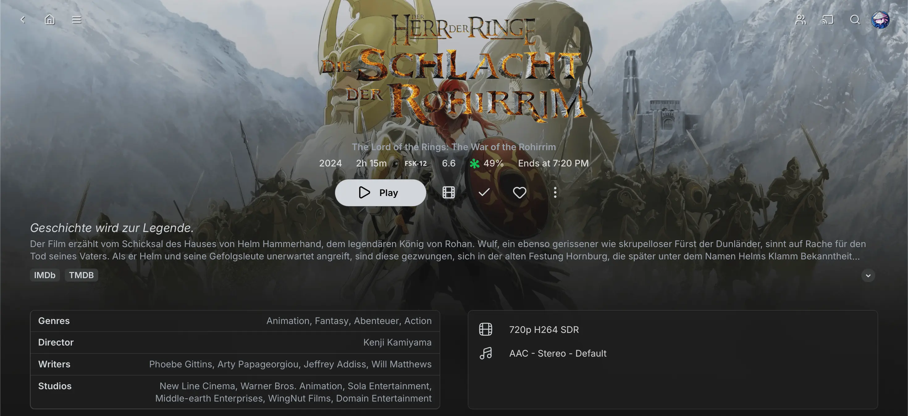

# Jellyfin Lucide Icons

This theme updates Jellyfin’s interface by replacing Google's Material Icons with the cleaner, more modern [Lucide Icons](https://lucide.dev). It works great with the [NeutralFin Theme](https://github.com/KartoffelChipss/NeutralFin/) or almost any other theme for JellyFin.


## 📦 Installation

You can install this theme by pasting the following code into the custom CSS box:

```css
@import url("https://cdn.jsdelivr.net/gh/KartoffelChipss/Jellyfin-Lucide@main/theme/jellyfin-lucide.css");
```

> [!IMPORTANT]  
> Please make sure to place this **BELOW** any other theme to ensure the right icons are used!

<details>
  <summary><strong>Detailed steps for server-side implementation (Theme is applied to everyone)</strong></summary>

1. Go to **Settings** → **Administration** tab.
2. Select the **General** tab from the sidebar.
3. Scroll to the **Branding** section.
4. Locate the **Custom CSS** field.
5. Paste your custom CSS into the box.
6. Click **Save** to apply the changes.

</details>

<details>
  <summary><strong>Detailed steps for client-side implementation (Theme is only applied to you)</strong></summary>

1. Go to **Settings** → **Display** tab.
2. Scroll down to find the **Custom CSS** field.
3. Paste your custom CSS into the box.
4. Click **Save** to apply the changes.

</details>

## 👀 Previews

<details>
    <summary><strong>Movie Page Icons Preview</strong></summary>



</details>

<details>
    <summary><strong>Sidebar Icons Preview</strong></summary>


</details>

<details>
    <summary><strong>Context menu Icons Preview</strong></summary>


</details>

## 🔍 Missing Icons

If you find a missing or wrong icon, you can [create an issue](https://github.com/KartoffelChipss/Jellyfin-Lucide/issues/new).

## ⚖️ License and Credits

This project is licensed under the ISC License. You are free to use, modify, and distribute this theme with proper attribution.

### Credits

• Jellyfin Lucide was created and is maintained by KartoffelChipss.

• This theme uses Lucide Icons, an open-source icon library licensed under the ISC License, as a modern alternative to Google’s Material Icons.

• Inspired by the desire for a cleaner, more minimalist user interface in Jellyfin.

### Disclaimer

> This project is an independent work and is not affiliated with, endorsed by, or officially associated with the Jellyfin project or its developers.

> Movie posters and media shown in the previews are for demonstration purposes only. All media content is the property of their respective copyright holders and is not included with this theme.
